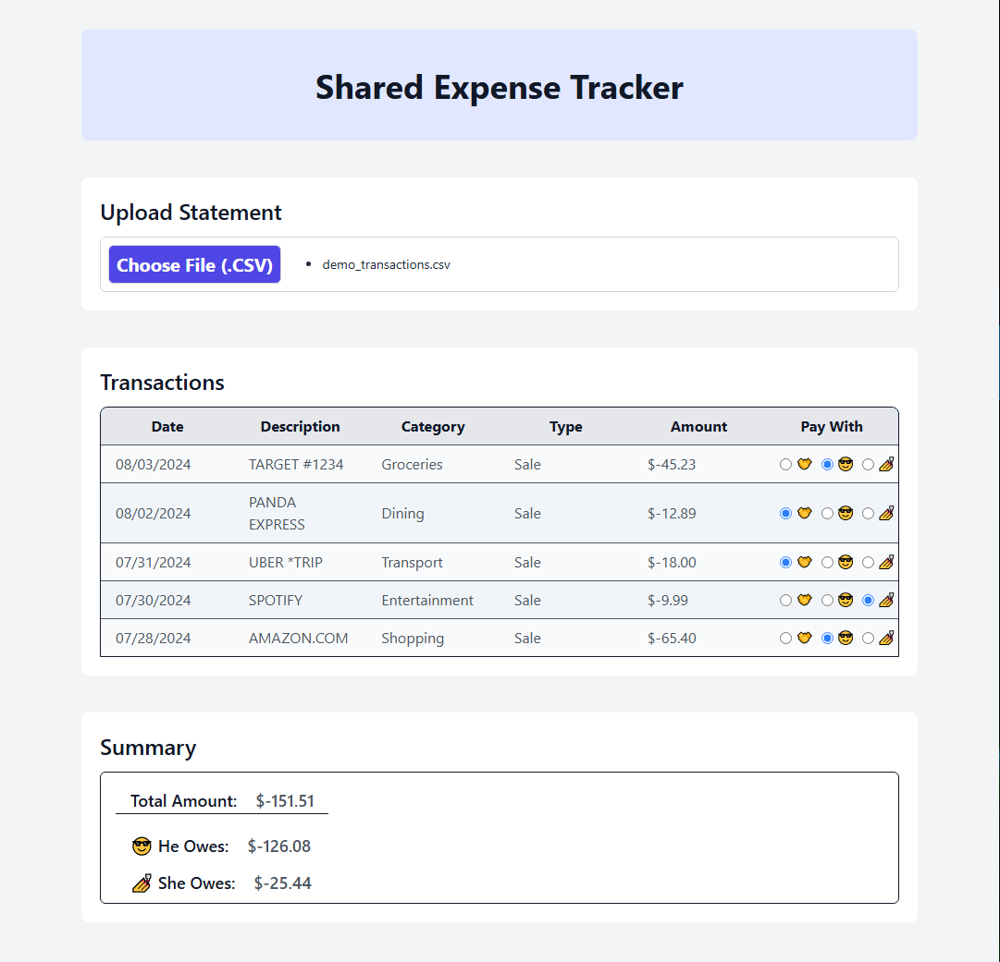

# Statement Splitter
Statement Splitter is a lightweight, browser-based personal finance tool for splitting shared expenses. Upload a CSV bank statement, categorize transactions, and visually assign who paid for what — perfect for couples, roommates, or group trips.

## 🧩 Features
- Import CSV bank statements
- Auto-format and display transaction history
- Manually assign payment responsibility
- Summary view of totals per person
- 100% client-side — no data is stored or sent
- No login, no external dependencies, no backend

## 🚀 Live Demo
👉 [Launch Visualizer](https://statement-split.netlify.app/)
👉 [Demo CSV Input](./public/demo_transactions.csv)

## 🔒 Privacy
This project runs entirely in the browser. It does not:
- Store or transmit user data
- Require login or authentication
- Include any payment processing

## 👨‍💻 Built With
- React
- TailwindCSS
- Vite
- Netlify

## 📂 Local Setup
git clone https://github.com/Jack-Underhill/StatementSplit.git
cd StatementSplit
npm install
npm run dev

## 📄 License
MIT — free to use and modify.